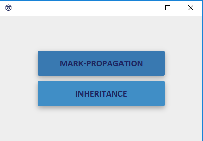
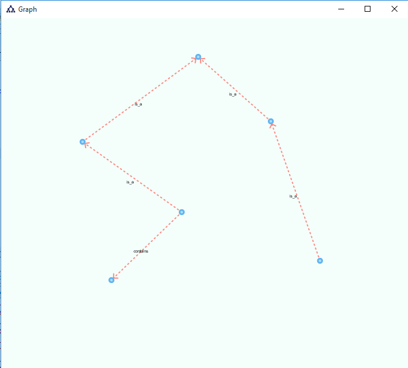
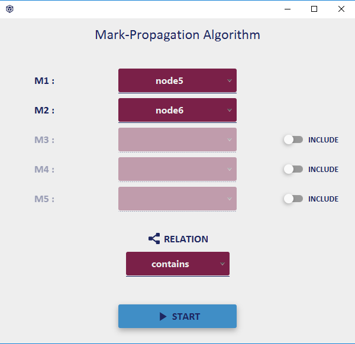
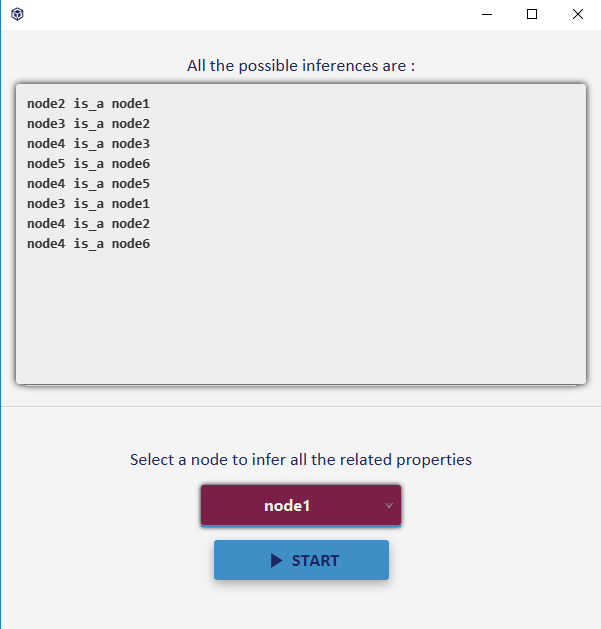
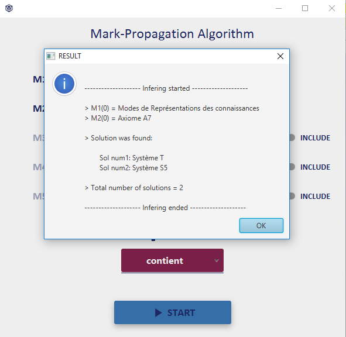
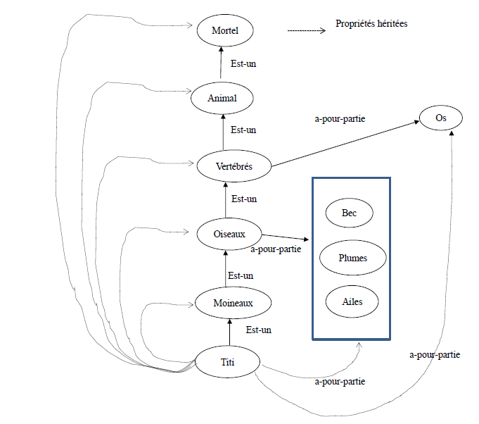
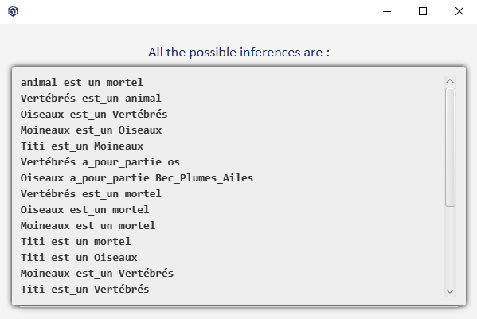
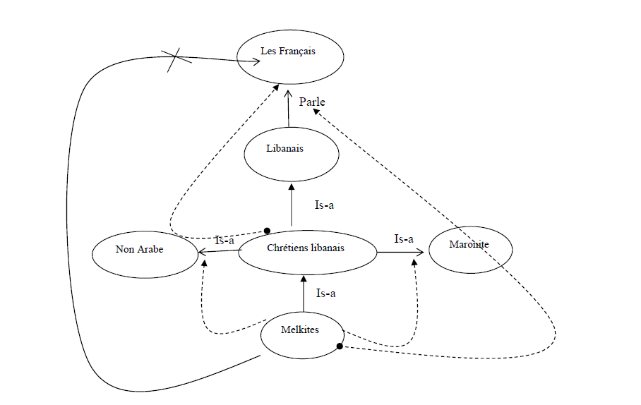
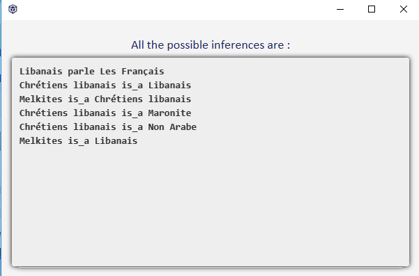
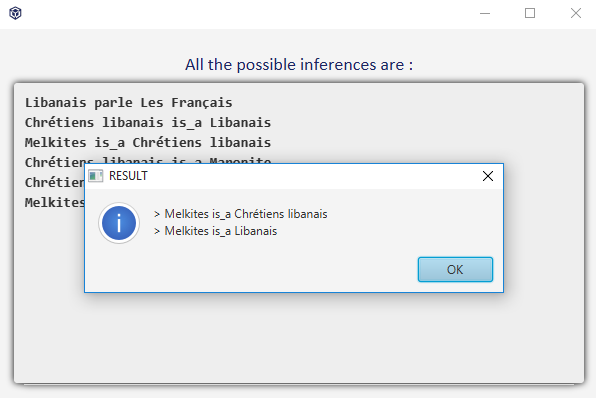

# SemanticNetwork
This is a study project which aim to implement Semantic networks and three of its major infering techniques : 
- Mark-Propagation
- Inheritance 
- Exceptions

## Features
* [x] Ability to create a semantic network defined by a set of nodes and relations.
* [x] Mark-propagation algorithm provide the ability to infer solutions - if there's any - to the question concerning the existance of a certain relation between 2 nodes or more.
* [x] Saturate the network (infer everything that can be using Inheritance algorithm).
* [x] Deduce all the properties relating to a specific node.
* [x] Display the network's graph view

## IDE
[Netbeans](https://netbeans.org/)

## GUI editor
[SceneBuilder](https://gluonhq.com/products/scene-builder/)

## Used libraries
- [jfoenix-8.0.8](http://jfoenix.com/) (a JavaFX material design library)
- [JavaFXSmartGraph-0.9.1](https://github.com/brunomnsilva/JavaFXSmartGraph)  (a generic JavaFX graph visualization library)
- [commons-lang3-3.10](http://commons.apache.org/proper/commons-lang/download_lang.cgi)

## Procedure

### Choice
When launching the application, this interface is the first interface with which a user will interact, you must chose the algorithm you want to use before building the network.

### Nodes entry
Define at least 2 nodes by giving a name to each node and click on `ADD`, the added nodes are displayed in the table below where you can delete any node.
  

### Relations entry
Add at least one relation by specifying its parent/child nodes and its name, the table below as with the interface of the nodes displays all the relations added and gives the possibility of deleting those chosen.
  

### Graph
After setting up the nodes and relations of our network and clicking on `NEXT`, an interface will appear displaying the generated graph.
  

### Mark-Propagation
Select two nodes (M1: start, M2: goal) - you can add more nodes if you wish by switching the toggle button for each Mi - you must also specify the relation sought then click on `START` to launch the algorithm.

### Inheritance
In this interface, the inherited relations are displayed in the text zone above, you can deduct all the properties of a certain node by selecting it from the `ChoiceBox` then by clicking on `START`, a panel of dialog will appear showing these properties.

## Tests
Tests were carried on 3 examples taken from our course where each example deal with one of the techniques:

### Example 1 (Mark-Propagation)

#### Nodes (id => name)

0 = > Reiter\
1 = > Modes de Représentations des connaissances\
2 = > Axe-IA\
3 = > Modes Logiques\
4 = > Modes Graphiques\
5 = > Logiques Classiques\
6 = > Logiques Non classiques\
7 = > Logique D’ordre 1\
8 = > Logique D’ordre 0\
9 = > Logique Modale\
10 = > ReiterLogique Des défauts\
11 = > Logiques De description\
12 = > Axiome A4\
13 = > Système T\
14 = > Système D\
15 = > Système S5\
16 = > Axiome A7\
17 = > a>a

#### Relations (parent_node, child_node, name)

(1, 0, dev)\
(2, 1, is_a)\
(1, 3, is_a)\
(1, 4, is_a)\
(3, 6, is_a)\
(3, 5, is_a)\
(5, 7, is_a)\
(5, 8, is_a)\
(6, 9, is_a)\
(6, 10, is_a)\
(6, 11, is_a)\
(12, 7, contient)\
(9, 13, is_a)\
(9, 14, is_a)\
(9, 15, is_a)\
(16, 13, contient)\
(16, 15, contient)\
(16, 17, is_a)

#### M1: Modes de Représentations des connaissances
#### M2: Axiome A7
#### Relation: contient
#### Solution(s): Système T, Système S5
#### Execution:

### Example 2 (Inheritance)

#### Nodes (id => name)

0 = > mortel\
1 = > animal\
2 = > Vertébrés\
3 = > Oiseaux\
4 = > Moineaux\
5 = > Titi\
6 = > os\
7 = > Bec_Plumes_Ailes

#### Relations (parent_node, child_node, name)

(0, 1, est_un)\
(1, 2, est_un)\
(2, 3, est_un)\
(3, 4, est_un)\
(4, 5, est_un)\
(6, 2, a_pour_partie)\
(7, 3, a_pour_partie)

#### Selected node : Titi

#### Execution:

### Example 3 (Exceptions)

#### Nodes (id => name)

0 = > Les Français\
1 = > Libanais\
2 = > Chrétiens libanais\
3 = > Melkites\
4 = > Maronite\
5 = > Non Arabe\

#### Relations (parent_node, child_node, name)

(0, 1, parle)\
(0, 2, is_not) - Exception\
(0, 3, is_not) - Exception\
(1, 2, is_a)\
(2, 3, is_a)\
(4, 2, is_a)\
(5, 2, is_a)\
(4, 3, is_not) - Exception\
(5, 3, is_not) - Exception

#### Selected node : Titi

#### Execution:

## How to contribute to this ?
* Enhancing graph's generation as the used library limit options as for example : making different typs arcs.
* Adding exceptions for Mark-Propagation algorithm.
* Adding other types of exceptions.
* Adding new techniques.
* Improving Mark-Propagation algorithm in a way that it traces all the M1s.
* Testing the techniques on other examples.

## Notes
- Exceptions works only with inheritance algorithm
- To add a relation of type simple exception just give it the name `is_not`
