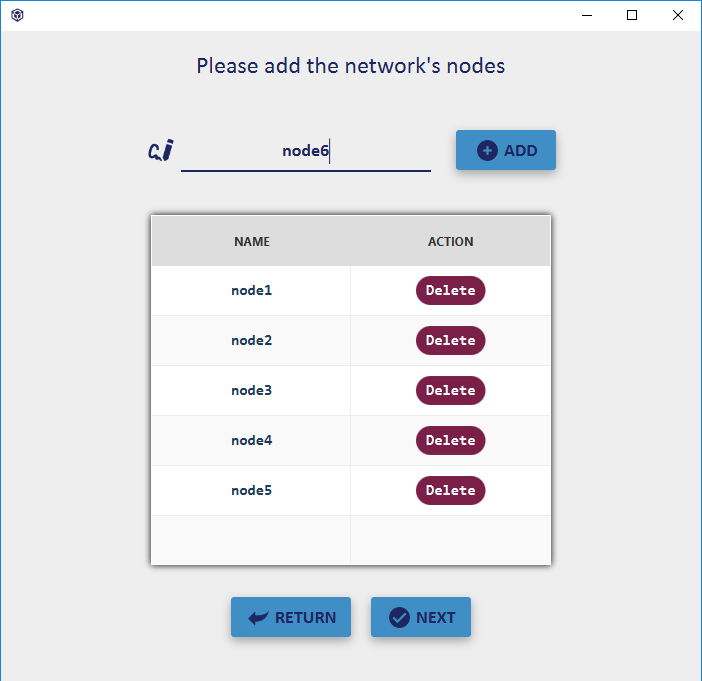
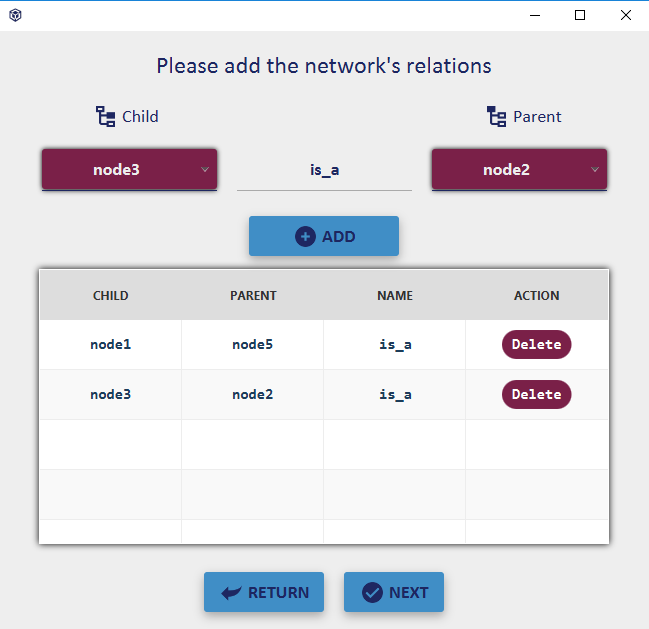

# SemanticNetworkFX
This is a study project which aim to implement Semantic networks and three of its major infering techniques : Mark-Propagation, Inheritance and exceptions.

## Features
* [x] Ability to create a semantic network defined by a set of nodes and relations.
* [x] Mark-propagation algorithm provide the ability to infer solutions - if there's any - to the question concerning the existance of a certain relation between 2 nodes or more.
* [x] Saturate the network (infer everything that can be using Inheritance algorithm).
* [x] Deduce all the properties relating to a specific node.
* [x] Displat the network's graph view

## IDE
[Netbeans](https://netbeans.org/)

## GUI editor
[SceneBuilder](https://gluonhq.com/products/scene-builder/)

## Used libraries
- [jfoenix-8.0.8](http://jfoenix.com/)
- [commons-lang3-3.10](http://commons.apache.org/proper/commons-lang/download_lang.cgi)
- [JavaFXSmartGraph-0.9.1](https://github.com/brunomnsilva/JavaFXSmartGraph)

## Screenshots

Nodes           |
:---------------------:|
 |

Relations           |
:---------------------:|
 |

Inheritance           |
:---------------------:|
 |
